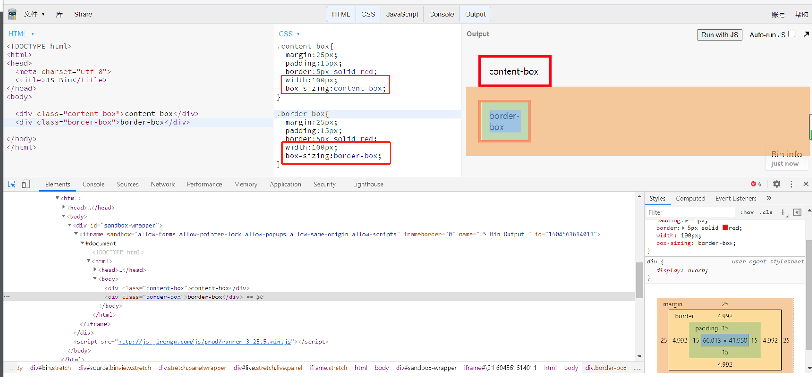

## 两种盒模型的区别
1. content-box
   content-box.width=内容宽度

2. border-box
   border-box.width=padding+border+content

 
在width都为100px,但是不同盒模型的情况下，一个content=100px,一个是content+padding+border=100px

 

## margin合并
* 哪些情况会合并（只会合并上下，左右不会合并）
  1. 父子margin
  2. 兄弟margin
   
* 如何阻止合并
   * 父子合并时：
     1. 添加padding/border
     2. 用overflow:hidden
     3. display:flex
    * 兄弟合并时：
      1. 一般兄弟合并时想看到的，不需要取消，如果一定要的话
      display:inline-block;
      width:100%;